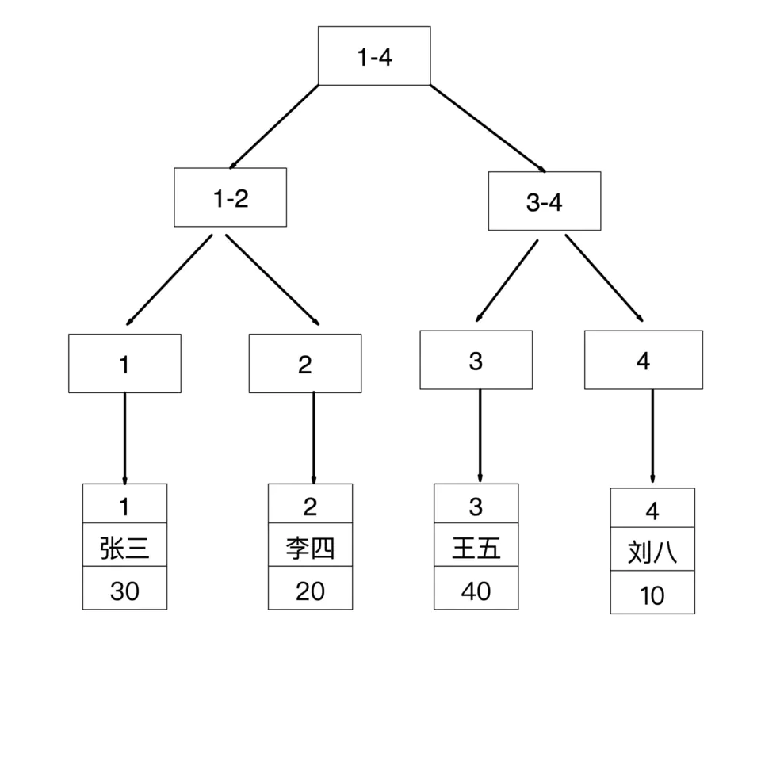
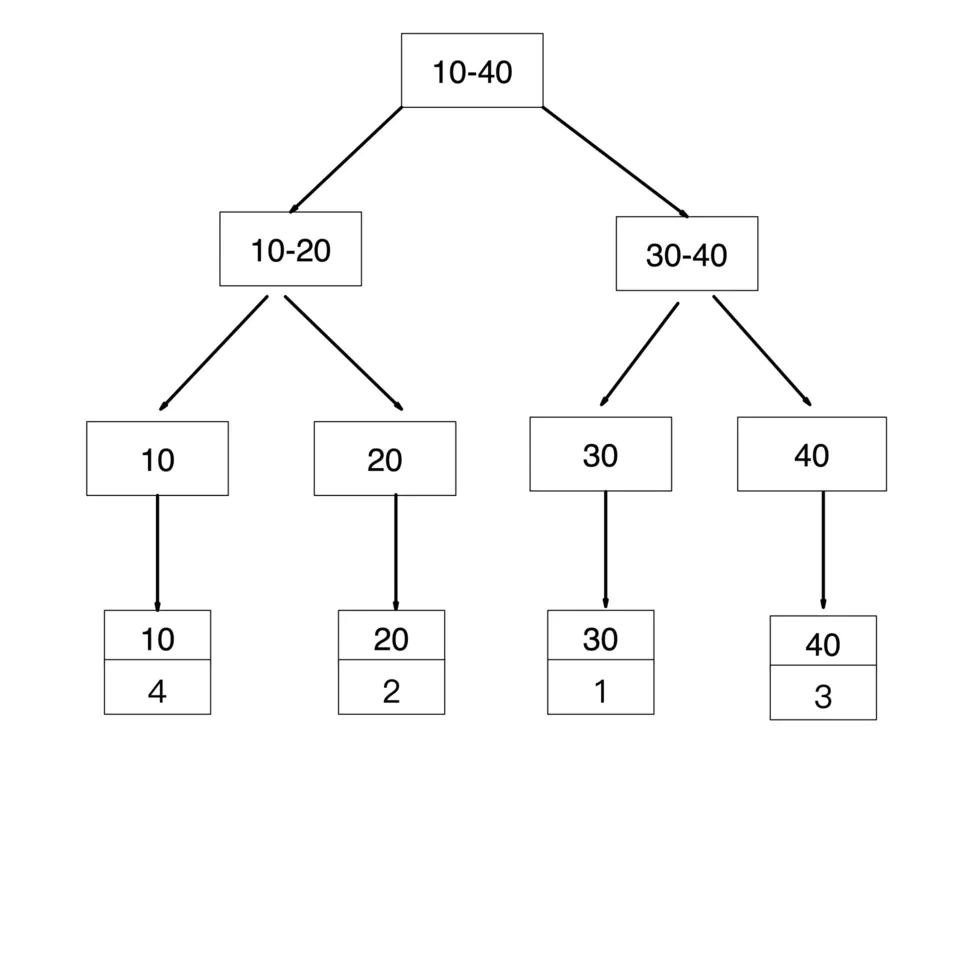
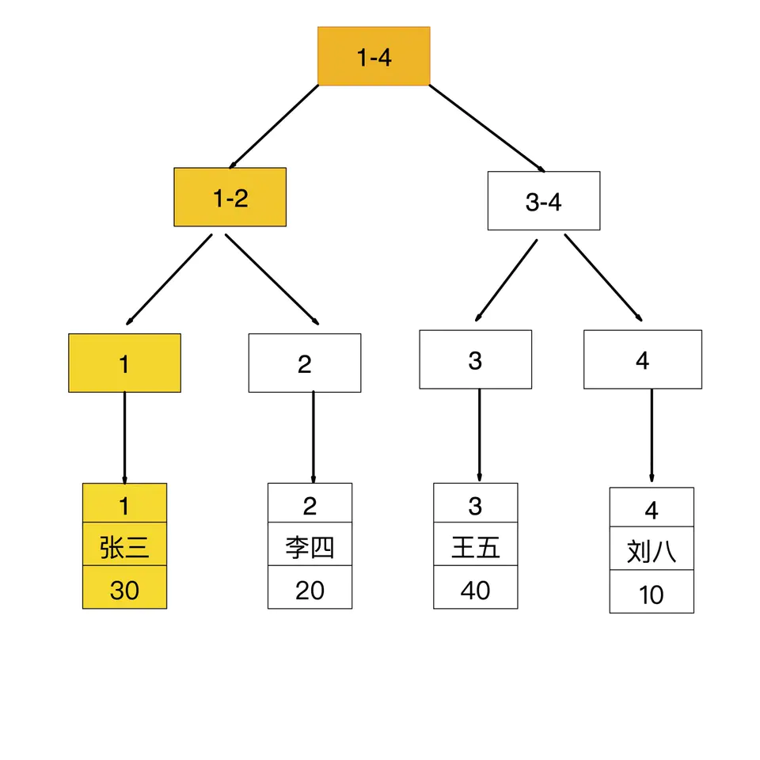
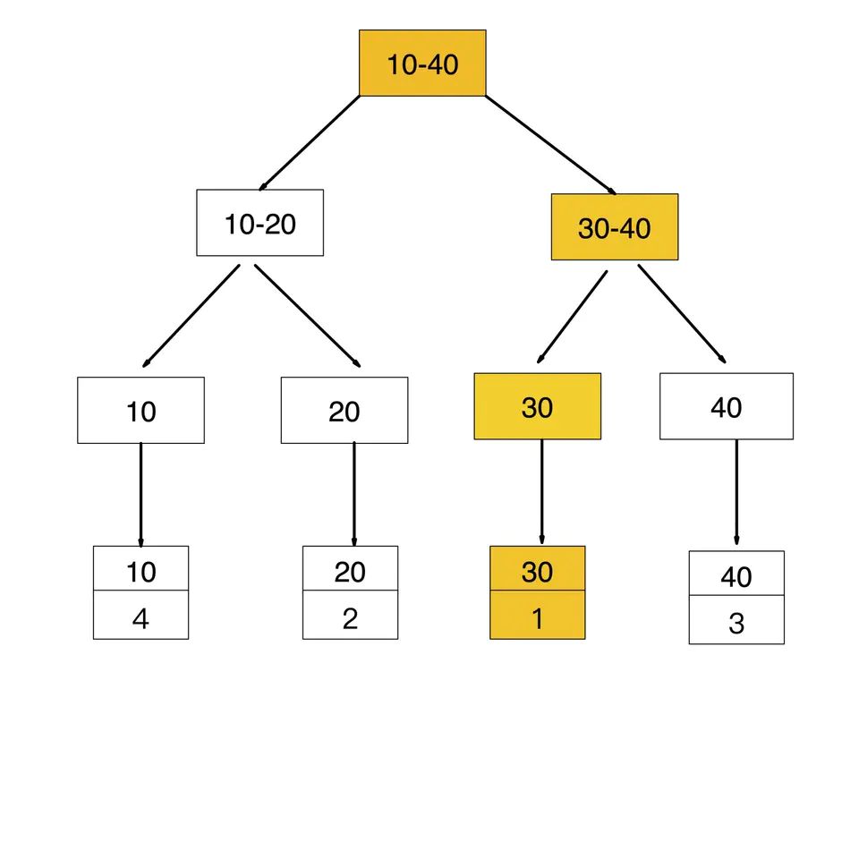
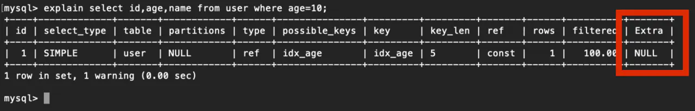

建表

```sql
mysql> create table user(  
 					id int(10) auto_increment,  
					name varchar(30),  
 					age tinyint(4),  
 					primary key (id),  
 					index idx_age (age)  
)engine=innodb charset=utf8mb4;
```

id 字段是聚簇索引，age 字段是普通索引（二级索引）

```sql
insert into user(name,age) values('张三',30);insert into user(name,age) values('李四',20);

insert into user(name,age) values('王五',40);insert into user(name,age) values('刘八',10);
```

```mysql
mysql> select * from user;

| id | name | age |
| 1 | 张三 | 30 |
| 2 | 李四 | 20 |
| 3 | 王五 | 40 |
| 4 | 刘八 | 10 |
```

索引存储结构

id 是主键，所以是聚簇索引，其叶子节点存储的是对应行记录的数据

​    

age 是普通索引（二级索引），非聚簇索引，其叶子节点存储的是聚簇索引的的值



聚簇索引查找过程

如果查询条件为主键（聚簇索引），则只需扫描一次B+树即可通过聚簇索引定位到要查找的行记录数据。

如：select * from user where id = 1;

​    


普通索引查找过程

如果查询条件为普通索引（非聚簇索引），需要扫描两次B+树，第一次扫描通过普通索引定位到聚簇索引的值，然后第二次扫描通过聚簇索引的值定位到要查找的行记录数据。如：select * from user where age = 30;

先通过普通索引 age=30 定位到主键值 id=12. 再通过聚集索引 id=1 定位到行记录数据复制代码

普通索引查找过程第一步

​    

普通索引查找过程第二步

​    

回表查询

先通过普通索引的值定位聚簇索引值，再通过聚簇索引的值定位行记录数据，需要扫描两次索引B+树，它的性能较扫一遍索引树更低。

索引覆盖

只需要在一棵索引树上就能获取SQL所需的所有列数据，无需回表，速度更快。

例如：select id,age from user where age = 10;

如何实现覆盖索引

常见的方法是：将被查询的字段，建立到联合索引里去。

1、如实现：select id,age from user where age = 10;

explain分析：因为age是普通索引，使用到了age索引，通过一次扫描B+树即可查询到相应的结果，这样就实现了覆盖索引

​    

2、实现：select id,age,name from user where age = 10;

explain分析：age是普通索引，但name列不在索引树上，所以通过age索引在查询到id和age的值后，需要进行回表再查询name的值。此时的Extra列的NULL表示进行了回表查询    

为了实现索引覆盖，需要建组合索引idx_age_name(age,name)

