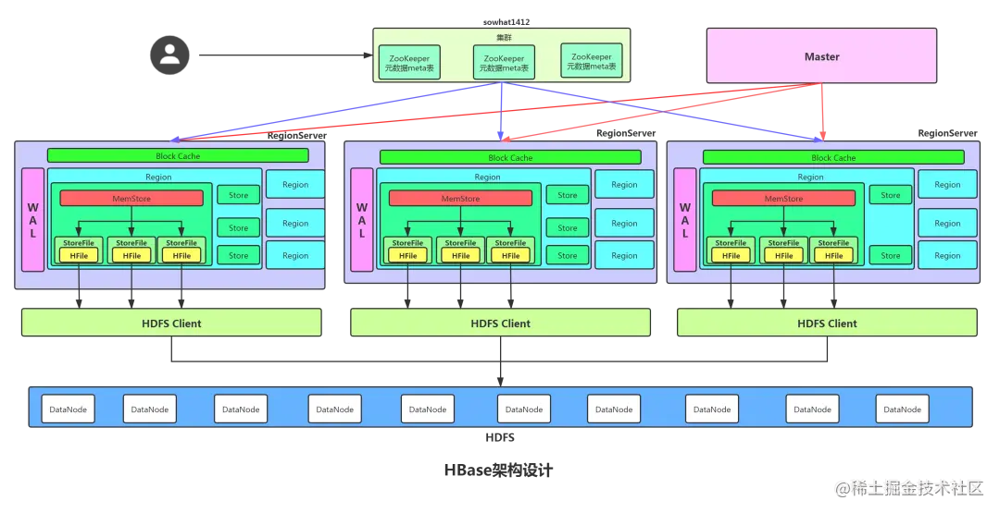

**HBase并不快，只是当数据量很大的时候它慢的不明显**

hbase的架构：

Master

Master只负责各种协调工作（其实就是打杂），比如建表、删表、移动Region、合并等操作。它们的共性就是需要跨RegionServer，这些操作由哪个RegionServer来执行都不合适，所以HBase就将这些操作放到了Master上了。而Master节点一般只有一个到两个，在HBase中，即使Master宕机了，集群依然可以正常地运行，依然可以存储和删除数据。

RegionServer

RegionServer 直接对接用户的读写请求，是真正的干活的节点。它的功能概括如下：

1. 管理Master为其分配的Region。
2. 处理来自客户端的读写请求。
3. 负责和底层HDFS的交互，存储数据到HDFS。
4. 负责Region变大以后的拆分。
5. 负责StoreFile的合并工作。

ZooKeeper

- 通过Zoopkeeper来保证集群中只有1个Master 在运行，如果Master 发生异常会通过竞争机制产生新的Master 来提供服务。
- 通过 Zoopkeeper 来监控 RegionServer 的状态
- 通过 Zoopkeeper 存储元数据 hbase:meata 的统一入口地址

RegionServer失效

ZooKeeper会监控 RegionServer 的上下线情况，当 ZK 发现某个 HRegionServer 宕机之后会通知 Master 进行失效备援。下线的 RegionServer 所负责的 Region 暂时停止对外提供服务，Master 会将该 RegionServer 所负责的 Region 转移到其他 RegionServer 上，并且会对 下线RegionServer 上存在 MemStore 中还未持久化到磁盘中的数据由 WAL重播进行恢复。

Region

就是一段数据的集合。HBase中的表一般拥有一个到多个Region。Region有以下特性：Region不能跨服务器，一个RegionServer上有一个或者多个Region。数据量小的时候，一个Region足以存储所有数据；但是，当数据量大的时候，HBase会拆分Region。当HBase在进行负载均衡的时候，也有可能会从一台RegionServer上把Region移动到另一台RegionServer上。Region是基于HDFS的，它的所有数据存取操作都是调用了HDFS的客户端接口来实现的。

WAL

WAL (Write-Ahead-Log) 预写日志是 HBase 的 RegionServer 在处理数据插入和删除的过程中用来记录操作内容的一种日志。每次Put、Delete等一条记录时，首先将其数据写入到 RegionServer 对应的HLog文件中去。只有当WAL日志写入成功的时候，客户端才会被告诉提交数据成功。如果写WAL失败会告知客户端提交失败，这其实就是数据落地的过程。

WAL是保存在HDFS上的持久化文件。数据到达 Region 时先写入WAL，然后被加载到MemStore中。这样就算Region宕机了，操作没来得及执行持久化，也可以再重启的时候从WAL加载操作并执行。跟Redis的AOF类似。

1. 在一个 RegionServer 上的所有 Region 都共享一个 HLog，一次数据的提交先写入WAL，写入成功后，再写入MenStore之中。当MenStore的值达到一定的时候，就会形成一个个StoreFile。
2. WAL 默认是开启*的，也可以手动关闭它，这样增删改操作会快一点。但是这样做牺牲的是数据的安全性。如果不想关闭WAL,又不想每次都耗费那么大的资源，每次改动都调用HDFS客户端，可以选择异步的方式写入WAL(默认间隔1秒写入)
3. 如果你学过 Hadoop 中的 Shuffle(edits文件) 机制的就可以猜测到 HBase 中的 WAL 也是一个滚动的日志数据结构，一个WAL实例包含多个WAL文件。

Store 

Store由 MemStore 跟 HFile 两个重要的部分。一个列族对应一个store，如果表只有一个列族，那么一个Region就一个store

MemStore

每个 Store 都有一个 MemStore 实例，数据写入到 WAL 之后就会被放入 MemStore 中。MemStore是内存的存储对象，当 MemStore 的大小达到一个阀值（默认64MB）时，MemStore 会被 flush到文件，即生成一个快照。目前HBase 会有一个线程来负责MemStore 的flush操作。

StoreFile

MemStore 内存中的数据写到文件后就是StoreFile，StoreFile底层是以 HFile 的格式保存。HBase以Store的大小来判断是否需要切分Region。

HFile

在Store中有多个HFile，每次刷写都会形成一个HFile文件落盘在HDFS上。HFile文件也会动态合并，它是数据存储的实体。

> 数据在进入HFile之前已经被存储到HDFS一次了，为什么还需要被放入Memstore
>
> 这是因为HDFS上的文件只能创建、追加、删除，但是不能修改。对于一个数据库来说，按顺序地存放数据是非常重要的，这是性能的保障，所以我们不能按照数据到来的顺序来写入硬盘。虽然很困难，但是办法还是有的。那就是使用内存先把数据整理成顺序存放，然后再一起写入硬盘。这就是Memstore存在的意义。虽然Memstore是存储在内存中的，HFile和WAL是存储在HDFS上的。但由于数据在写入Memstore之前，要先被写入WAL，所以增加Memstore的大小并不能加速写入速度。Memstore存在的意义是维持数据按照rowkey顺序排列，而不是做一个缓存。 LSM树型结构

> 归纳起来就是这样：
>
> 一个RegionServer包含多个Region，划分规则是：一个表的一段键值在一个RegionServer上会产生一个Region。不过当你1行的数据量太大了（要非常大，否则默认都是不切分的），HBase也会把你的这个Region根据列族切分到不同的机器上去。一个Region包含多个Store，划分规则是：一个列族分为一个Store，如果一个表只有一个列族，那么这个表在这个机器上的每一个Region里面都只有一个Store。一个Store里面只有一个Memstore。一个Store里面有多个HFile（StoreFile是HFile的抽象对象，所以如果说到StoreFile就等于HFile）。每次Memstore的刷写（flush）就产生一个新的HFile出来。

