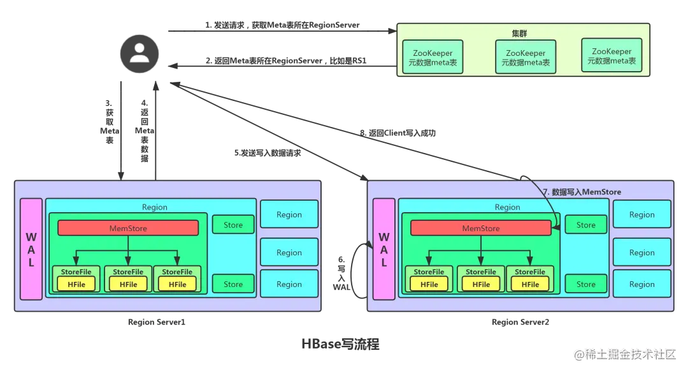
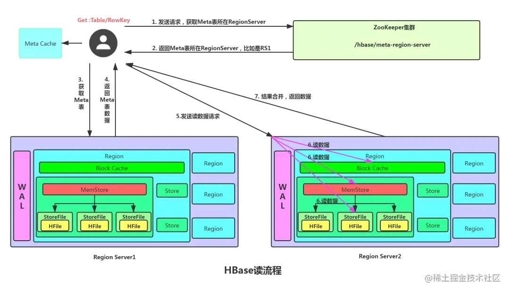

hbase的写流程：

1. Client 先访问 zookeeper，访问 /hbase/meta-region-server 获取 hbase:meta 表位于哪个 RegionServer。
2. 访问对应的 Region Server，获取 hbase:meta 表，根据读请求的 namespace:table/rowkey，查询出目标数据位于哪个 Region Server 中的哪个 Region 中。并将该 table 的 Region 信息以及 meta 表的位置信息缓存在客户端的 meta cache，方便下次访问。
3. 与目标 Region Server 进行通讯。
4. 将数据顺序写入（追加）到 WAL。
5. 将数据写入对应的 MemStore，数据会在 MemStore 进行排序。
6. 向客户端发送 ack，此处可看到数据不是必须落盘的。
7. 等达到 MemStore 的刷写时机后，将数据刷写到 HFile

hbase的读流程：

1. Client 先访问 ZooKeeper，获取 hbase:meta 表位于哪个 Region Server。
2. 访问对应的 Region Server，获取 hbase:meta 表，根据读请求的 namespace:table/rowkey， 查询出目标数据位于哪个 Region Server 中的哪个 Region 中。并将该 table 的 region 信息以 及 meta 表的位置信息缓存在客户端的 meta cache，方便下次访问。
3. 与目标 Region Server 进行通讯。
4. 分别在 Block Cache(读缓存)，MemStore 和 Store File(HFile)中查询目标数据，并将 查到的所有数据进行合并。此处所有数据是指同一条数据的不同版本(time stamp)或者不同的类型(Put/Delete)。
5. 将从文件HFile中查询到的数据块(Block，HFile 数据存储单元，默认大小为 64KB)缓存到 Block Cache。
6. 将合并后的最终结果，然后返回时间最新的数据返回给客户端。

