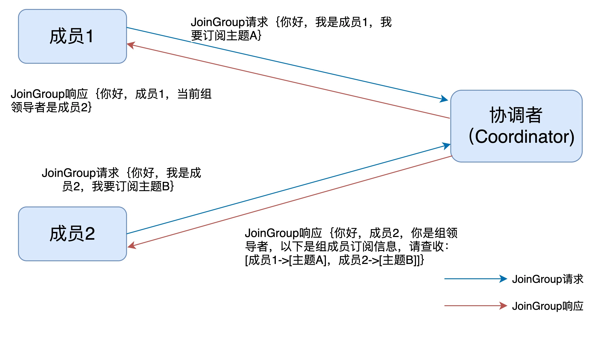
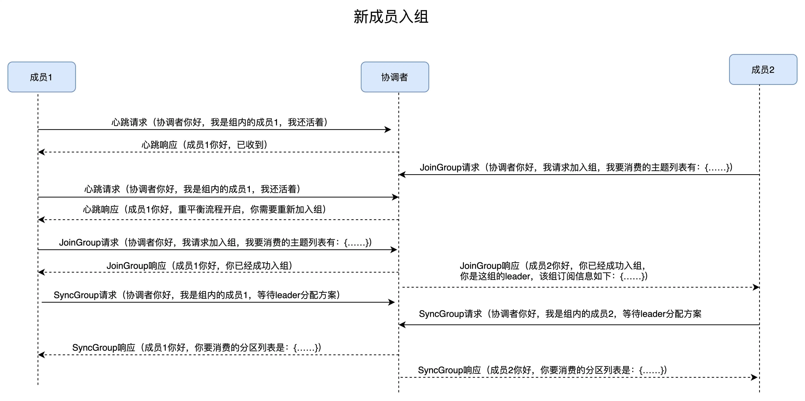
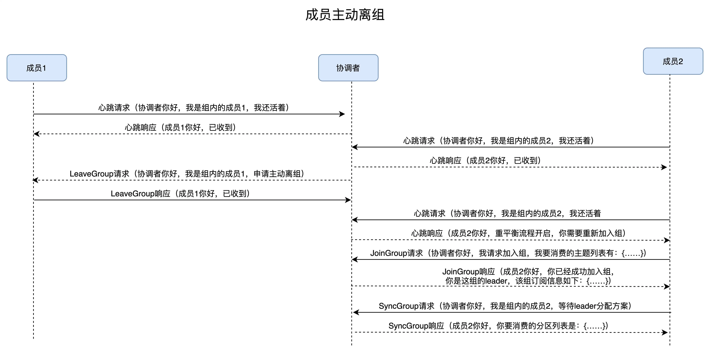

### 消费者组重平衡

------

消费者组的重平衡流程，它的作用是让组内所有的消费者实例就消费哪些主题分区达成一致。重平衡需要借助 Kafka Broker 端的 Coordinator 组件，在 Coordinator 的帮助下完成整个消费者组的分区重分配。

#### 触发与通知

------

1、组成员数量发生变化。

2、订阅主题数量发生变化。

3、订阅主题的分区数发生变化。

> 在实际生产环境中，因命中第 1 个条件而引发的重平衡是最常见的。另外，消费者组中的消费者实例依次启动也属于第 1 种情况，也就是说，每次消费者组启动时，必然会触发重平衡过程。

重平衡的通知机制正是通过心跳线程来完成的。当协调者决定开启新一轮重平衡后，它会将“REBALANCE_IN_PROGRESS”封装进心跳请求的响应中，发还给消费者实例。当消费者实例发现心跳响应中包含了“REBALANCE_IN_PROGRESS”，就能立马知道重平衡又开始了，这就是重平衡的通知机制。

#### consumer端消费者组重平衡流程

------

在消费者端，重平衡分为两个步骤：分别是加入组（JoinGroup）和等待领导者消费者（SyncGroup）

##### step1 joinGroup

##### step2 syncGroup

#### broker端消费者组重平衡流程

##### 场景一：新成员入组

当协调者收到新的 JoinGroup 请求后，它会通过心跳请求响应的方式通知组内现有的所有成员，强制它们开启新一轮的重平衡。

场景二：组成员主动离组

何谓主动离组？就是指消费者实例所在线程或进程调用 close() 方法主动通知协调者它要退出。这个场景就涉及到了第三类请求：LeaveGroup 请求。协调者收到 LeaveGroup 请求后，依然会以心跳响应的方式通知其他成员

场景三：组成员崩溃离组

崩溃离组是指消费者实例出现严重故障，突然宕机导致的离组。它和主动离组是有区别的，因为后者是主动发起的离组，协调者能马上感知并处理。但崩溃离组是被动的，协调者通常需要等待一段时间才能感知到，这段时间一般是由消费者端参数 session.timeout.ms 控制的。也就是说，Kafka 一般不会超过 session.timeout.ms 就能感知到这个崩溃。

场景四：重平衡时协调者对组内成员提交位移的处理

正常情况下，每个组内成员都会定期汇报位移给协调者。当重平衡开启时，协调者会给予成员一段缓冲时间，要求每个成员必须在这段时间内快速地上报自己的位移信息，然后再开启正常的 JoinGroup/SyncGroup 请求发送。

