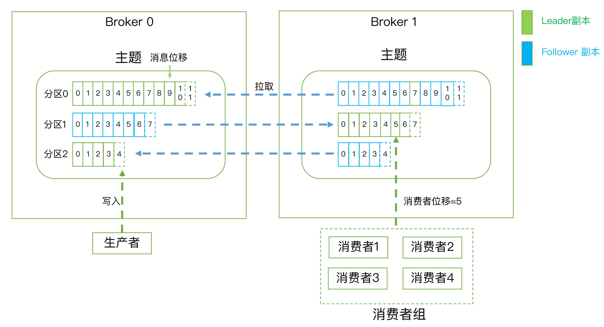

### 基本概念

------

1. 消息(Record)：Kafka 是消息引擎嘛，这里的消息就是指 Kafka 处理的主要对象；

2. 主题(Topic)：主题是承载消息的逻辑容器，在实际使用中多用来区分具体的业务；

3. 分区(Partition)：一个有序不变的消息序列,通过分区实现顺序消息，每个主题下可以有多个分区；

4. 分区位移(Offset)：表示分区中每条消息的位置信息，是一个单调递增且不变的值；

5. 消费者位移(Consumer Offset)：表征消费者消费进度，每个消费者都有自己的消费者位移；

6. 副本(Replica)：Kafka 中同一条消息能够被拷贝到多个地方以提供数据冗余，这些地方就是所谓的副本，副本分为leader副本和follower副本，副本是在分区层级下的，即每个分区可配置多个副本实现高可用；leader副本与客户端进行交互，follower副本被动的跟随leader副本，不与外界副本进行交互(数据不一致问题)

7. 生产者(Producer)：向主题发布新消息的应用程序；

8. 消费者(Consumer)：从主题订阅新消息的应用程序；

9. 消费者组(Consumer Group)：多个消费者实例共同组成的一个组，同时消费多个分区以实现高吞吐；

10. 重平衡(Rebalance)：消费者组内某个消费者实例挂掉后，其他消费者实例自动重新分配订阅主题分区的过程，

11. ISR：所有与leader副本保持一定程度同步的副本(包括leader副本在内)组成ISR(In-Sync Replicas)；

12. OSR：与leader副本同步滞后过多的副本(不包括leader副本)组成OSR(Out-of-Sync Replicas)；

13. AR：分区中的所有副本统称为AR，AR=ISR+OSR，在正常情况下，所有的 follower 副本都应该与 leader 副本保持一定程度的同步，即AR=ISR，OSR集合为空；

14. 控制器：其实就是一个broker，只不过它除了具有一般broker的功能之外，还负责分区首领的选举。

    > 集群里第一个启动的broker通过在Zookeeper里创建一个临时节点/controller让自己成为控制器。其他broker在控制器节点上创建 watch对象，这样它们就可以收到这个节点的变更通知。

　

