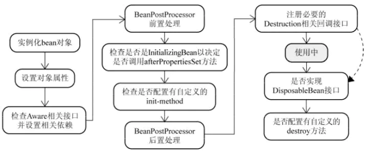
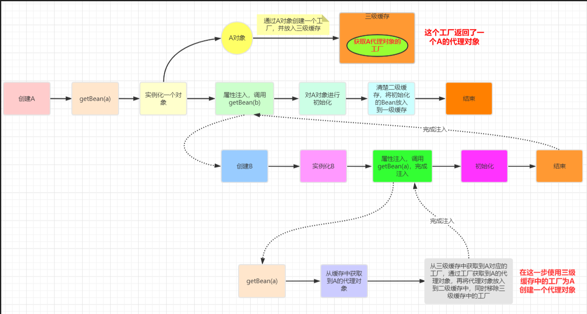

### Spring AOP

  Spring AOP采用的是动态代理，在运行期间对业务方法进行增强，所以不会生成新类，对于动态代理技术，Spring AOP提供了对JDK动态代理的支持以及CGLib的支持。

  JDK动态代理只能为接口创建动态代理实例，而不能对类创建动态代理。需要获得被目标类的接口信息（应用Java的反射技术），生成一个实现了代理接口的动态代理类（字节码），再通过反射机制获得动态代理类的构造函数，利用构造函数生成动态代理类的实例对象，在调用具体方法前调用invokeHandler方法来处理。

  CGLib动态代理需要依赖asm包，把被代理对象类的class文件加载进来，修改其字节码生成子类。

  通过Enable注解注册AnnotationAwareAspectJAutoProxyCreator；

  继承BeanPostProcessor，在后置处理中为没有对象生成代理；

  找到当前对象适配的Advisor（缓存）

  通过ProxyFactory，获取AopProxy（jdk,cglib），通过jdk、cglib创建代理对象；

1、放到三级缓存中

2、填充属性，从刚刚的缓存中拿，这个地方可以创建代理

3、初始化之后创建代理   

### IOC

“控制反转”，不是什么技术，而是一种设计思想；

控制：控制的是bean的创建、管理、销毁等对象的生命周期；

反转：把对bean的控制交给了spring容器；

也就是说，我们只需要做好配置，不需要手动的创建、销毁bean对象，如果是单例bean，在容器启动的时候，会为我们初始化好所有的bean，提高运行速度；

IOC提供了一个重要的功能就是DI（依赖注入），也就是通过配置，将资源的注入到对象中，维护对象之间的关系；DI提供的一个重要好处就是解耦，对象之间的配置关系通过配置文件来维护，有spring ioc容器维护；

1.   环境属性的初始化和验证，启动时间记录和相关标记设置；
2.   获取资源：资源的定位，对指定的资源路径进行解析定位然后获取对应的资源；
3. obtainBeanFactory()，获取BeanFactory ，DefaultListableBeanFactory；
4.   资源解析，将resource解析成document，封装成BeanDefinition，注册到BeanDefinitionRegistry；
5.   调用 BeanFactoryPostProcessor springboot 自动装配
6.   注册 BeanPostProcessors，BeanPostProcessors 是进行扩展的关键组件；
7.   初始化Aware等 Bean和进行其他的的上下文初始化主要用于扩展；
8.   注册 ApplicationListene 将 ApplicationListene 注册到 BeanFactory 中
9.   实例化剩余的 Bean单例，这里需要对所有剩余的单例 Bean 进行实例化；
10.   启动完成 资源回收，分发"刷新完成"事件

###   bean生命周期

1.   Spring 容器根据实例化策略对bean进行实例化。
2.   实例化完成后，如果该bean设置了一些属性的话，则利用set方法设置一些属性。
3.   如果该 bean实现了aware接口，则调用set()方法。
4.   如果该容器注册了BeanPostProcessor，则会调用postProcessBeforeInitialization() 方法完成 bean前置处理
5.   如果该 bean实现了 InitializingBean 接口，则调用afterPropertiesSet() 方法。
6.   如果该 bean配置了 init-method 方法，则调用 init-method 指定的方法。
7.   如果该容器注册了BeanPostProcessor则会调用postProcessAfterInitialization() 方法完成 bean 的后置处理。
8.   对象完成初始化，开始方法调用。
9.   在容器进行关闭之前，如果该bean实现了DisposableBean接口，则调用 destroy() 方法。
10.   在容器进行关闭之前，如果该bean 配置了destroy-method，则调用其指定的方法。
11.   到这里一个 bean 也就完成了它的一生

### spring事务

支持当前事务的情况：

- TransactionDefinition.PROPAGATION_REQUIRED： 如果当前存在事务，则加入该事务；如果当前没有事务，则创建一个新的事务。
- TransactionDefinition.PROPAGATION_SUPPORTS： 如果当前存在事务，则加入该事务；如果当前没有事务，则以非事务的方式继续运行。
- TransactionDefinition.PROPAGATION_MANDATORY： 如果当前存在事务，则加入该事务；如果当前没有事务，则抛出异常。（mandatory：强制性）

不支持当前事务的情况：

- TransactionDefinition.PROPAGATION_REQUIRES_NEW： 创建一个新的事务，如果当前存在事务，则把当前事务挂起。
- TransactionDefinition.PROPAGATION_NOT_SUPPORTED： 以非事务方式运行，如果当前存在事务，则把当前事务挂起。
- TransactionDefinition.PROPAGATION_NEVER： 以非事务方式运行，如果当前存在事务，则抛出异常。

- TransactionDefinition.PROPAGATION_NESTED:如果当前存在事务，则在嵌套事务内执行。如果当前没有事务，则创建一个新的事务。

spring 事务不生效

- 同一个类中调用  没有用到代理
- 异常处理问题  
- 非public方法

### spring设计模式

  工厂设计模式:Spring使用工厂模式通过 BeanFactory、ApplicationContext 创建 bean 对象。

  代理设计模式:Spring AOP 功能的实现。

  单例设计模式:Spring 中的 Bean 默认都是单例的。

  模板方法模式:Spring 中 jdbcTemplate、hibernateTemplate 等以 Template 结尾的对数据库操作的类，它们就使用到了模板模式。

  包装器设计模式:我们的项目需要连接多个数据库，而且不同的客户在每次访问中根据需要会去访问不同的数据库。这种模式让我们可以根据客户的需求能够动态切换不同的数据源。

  观察者模式:Spring 事件驱动模型就是观察者模式很经典的一个应用。

  适配器模式:Spring AOP 的增强或通知(Advice)使用到了适配器模式、spring MVC 中也是用到了适配器模式适配Controller。

### bean的作用域

| singleton      | 在spring IoC容器仅存在一个Bean实例，Bean以单例方式存在，默认值 |
| -------------- | ------------------------------------------------------------ |
| prototype      | 每次从容器中调用Bean时，都返回一个新的实例，即每次调用getBean()时，相当于执行newXxxBean() |
| request        | 每次HTTP请求都会创建一个新的Bean，该作用域仅适用于WebApplicationContext环境 |
| session        | 同一个HTTP Session共享一个Bean，不同Session使用不同的Bean，仅适用于WebApplicationContext环境 |
| global-session | 一般用于Portlet应用环境，该运用域仅适用于WebApplicationContext环境 |

### 三级缓存

所谓循环依赖，其实就是A对象中注入了B对象，B对象中也注入了A对象

首先明确的就是spring对循环依赖有三种情况

- 非单例模式下的循环依赖：无法解决
- 完全构造器的循环依赖：无法解决循环依赖，会抛出BeanCurrentlyInCreationException
- 单例模式下的setter循环依赖，或者部分构造器注入：通过三级缓存解决的循环依赖 singletonObjects、earlySingletonObjects、singletonFactories

单例模式下的循环依赖：

spring单例对象的初始化大致分为

- createBeanInstance:实例化，其实也就是通过反射调用对象的构造方法
- populateBean：填充属性
- initializeBean：初始化方法 

### spring mvc

第一步：用户发送请求到前端控制器（DispatcherServlet）。

第二步：DispatcherServlet请求 HandlerMapping 查找 Controller，可以根据 xml 配置、注解进行查找。

第三步：处理器映射器 HandlerMapping 向DispatcherServlet返回 Controller

第四步：DispatcherServlet调用HandlerAdapter去执行 Controller

第五步：处理器适配器（HandlerAdapter）执行 Controller

第六步：Handler 执行完成后给适配器返回 ModelAndView

第七步：处理器适配器（HandlerAdapter）向前端控制器返回 ModelAndView ModelAndView 是SpringMVC 框架的一个底层对象，包括 Model 和 View

第八步：前端控制器请求试图解析器去进行视图解析 根据逻辑视图名来解析真正的视图。

第九步：试图解析器向前端控制器返回 view

第十步：前端控制器进行视图渲染 就是将模型数据（在 ModelAndView 对象中）填充到 request 域

### springboot

启动流程主要分为三个部分

1、进行SpringApplication的实例化，

  配置一些基本的环境变量、判断应用类型、注册监听器、推断启动类；

2、实现了应用具体的启动方案run方法、经典的观察者模式、事件广播的顺序

创建一个StopWatch实例，用来记录SpringBoot的启动时间

通过SpringFactoriesLoader加载listeners：比如EventPublishingRunListener

发布SpringBoot开始启动事件（EventPublishingRunListener#starting()）

创建和配置environment（EventPublishingRunListener#environmentPrepared()）

打印SpringBoot的banner和版本

创建对应的ApplicationContext：Web类型，Reactive类型，普通的类型(非Web)

prepareContext

准备ApplicationContext，最终会调用到AbstractApplicationContext#refresh方法，实际上就是Spring IOC容器的创建过程，并且会进行自动装配的操作

stopWatch停止计时，日志打印总共启动的时间

发布SpringBoot程序已启动事件(EventPublishingRunListener#started())

调用ApplicationRunner和CommandLineRunner

最后发布就绪事件ApplicationReadyEvent，标志着SpringBoot可以处理就收的请求了(running())

3、是自动化配置模块，该模块作为springboot自动配置核心

3.1、@SpringBootApplication、@EnableAutoConfiguration

3.2、@Import({AutoConfigurationImportSelector.**class**})

3,3、AutoConfigurationImportSelector > srping.factories  > SpringFactoriesLoader > @condition

3.4、> ConfigurationClassPostProcessor 

  \> BeanDefinitionRegistryPostProcessor 

  \> BeanFactoryPostProcessor