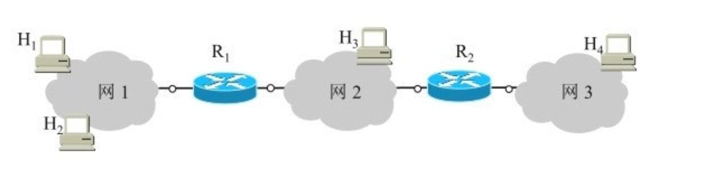

## 网络层

### 一、网络层的设计		

因特网采用的设计思路是这样的：***网络层向上只提供简单灵活的、无连接的、尽最大努力交付的数据报服务***。网络在发送分组时不需要先建立连接。每一个分组（也就是IP数据报）独立发送，与其前后的分组无关（不进行编号）。***网络层不提供服务质量的承诺***。也就是说，所传送的分组可能出错、丢失、重复和失序（即不按序到达终点），当然也不保证分组交付的时限。由于传输网络不提供端到端的可靠传输服务，这就使网络中的路由器可以做得比较简单，而且价格低廉。***如果主机中的进程之间的通信需要是可靠的，那么就由网络的主机中的运输层负责（包括差错处理、流量控制等）。***

### 二、网际协议IP

网际协议IP是TCP/IP体系中两个最主要的协议之一，也是最重要的因特网标准协议之一。

TCP/IP体系在网络互连上采用的做法是在网络层采用了标准化协议，但相互连接的网络则可以是异构的。由于参加互连的计算机网络都使用相同的网际协议IP, 因此可以把互连以后的计算机网络看成一个虚拟互连网络(internet)。所谓虚拟互连网络也就是逻辑互连网络，它的意思就是互连起来的各种物理网络的异构性本来是客观存在的，但是我们利用IP协议就可以使这些性能各异的网络在网络层上看起来好像是一个统一的网络。这种使用IP协议的虚拟互连网络可简称为IP网。使用IP网的好处是：当IP网上的主机进行通信时，就好像在一个单个网络上通信一样，它们看不见互连的各网络的具体异构细节（如具体的编址方案、路由选择协议，等等）。	

### 三、IP地址与硬件地址

从层次的角度看，***物理地址是数据链路层和物理层使用的地址，而IP地址是网络层和以上各层使用的地址，是一种逻辑地址***。

在发送数据时，数据从高层下到低层，然后才到通信链路上传输。使用IP地址的IP数据报一旦交给了数据链路层，就被封装成MAC帧了。MAC帧在传送时使用的源地址和目的地址都是硬件地址，这两个硬件地址都写在MAC帧的首部中。

连接在通信链路上的设备（主机或路由器）在接收MAC帧时，其根据是MAC帧首部中的硬件地址。在数据链路层看不见隐藏在MAC帧的数据中的IP地址。只有在剥去MAC帧的首部和尾部后把MAC层的数据上交给网络层后，网络层才能在IP数据报的首部中找到源IP地址和目的IP地址。

***总之，IP 地址放在 IP 数据报的首部，而硬件地址则放在 MAC 帧的首部。在网络层和网络层以上使用的是 IP 地址，而数据链路层及以下使用的是硬件地址。***

### 四、地址解析协议ARP

***ARP协议的用途是为了从网络层使用的IP地址解析出在数据链路层使用的硬件地址。***

网络层使用的是IP地址，但在实际网络的链路上传送数据帧时，最终还是必须使用该网络的硬件地址。但IP地址和下面的网络的硬件地址之间由于格式不同而不存在简单的映射关系。地址解析协议ARP解决这个问题的方法是***在主机ARP高速缓存中应存放一个从IP地址到硬件地址的映射表，并且这个映射表还经常动态更新***。

当主机A要向本局域网上的某个主机B发送IP数据报时，就先在其ARP高速缓存中查看有无主机B的IP地址。如有，就在ARP高速缓存中查出其对应的硬件地址，再把这个硬件地址写入MAC帧，然后通过局域网把该MAC帧发往此硬件地址。也有可能查不到主机B的IP地址的项目。这可能是主机B才入网，也可能是主机A刚刚加电，其高速缓存还是空的。在这种情况下，主机A就自动运行ARP, 找出主机B的硬件地址。

***ARP是解决同一个局域网上的主机或路由器的IP地址和硬件地址的映射问题。***

下面我们归纳出使用ARP的四种典型情况

1. 发送方是主机（如H1），要把IP数据报发送到同一个网络上的另一个主机（如H2）。这时H1发送ARP请求分组（在网1上广播），找到目的主机H2的硬件地址。(2)发送方是主机（如H1），要把IP数据报发送到另一个网络上的一个主机（如H3或H4）。这时H1发送ARP请求分组（在网1上广播），找到网1上的一个路由器R1的硬件地址。剩下的工作由路由器R1来完成。	
2. 发送方是主机（如H1），要把IP数据报发送到另一个网络上的一个主机（如H3或H4）。这时H1发送ARP请求分组（在网1上广播），找到网1上的一个路由器R1的硬件地址。剩下的工作由路由器R1来完成。
3. 发送方是路由器（如R1），要把IP数据报转发到与R1连接在同一个网络（网2）上的主机（如H3）。这时R1发送ARP请求分组（在网2上广播），找到目的主机H3的硬件地址。
4. 发送方是路由器（如R1），要把IP数据报转发到网3上的一个主机（如H4）。H4与R1不是连接在同一个网络上。这时R1发送ARP请求分组（在网2上广播），找到连接在网2上的一个路由器R2的硬件地址。剩下的工作由这个路由器R2来完成。

### 五、ip数据报格式

​			

