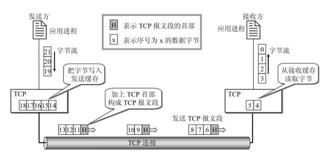
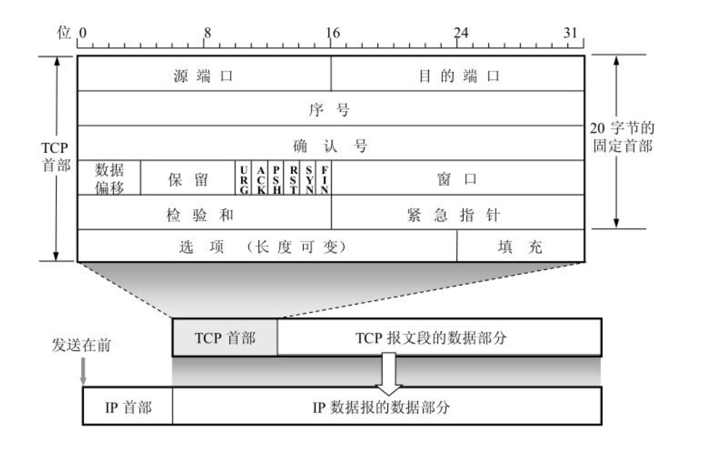

## TCP

### 一、tcp概述

1、TCP是***面向连接的运输层协议***

2、每一条***TCP连接只能有两个端点***(endpoint)，每一条TCP连接只能是点对点的（一对一）

3、***TCP提供可靠交付的服务，通过TCP连接传送的数据，无差错、不丢失、不重复、并且按序到达***

4、TCP提供***全双工通信***，TCP允许通信双方的应用进程在任何时候都能发送数据

5、 ***<u>面向字节流，TCP中的流(stream)指的是流入到进程或从进程流出的字节序列。“面向字节流”的含义是：虽然应用程序和TCP的交互是一次一个数据块，但TCP把应用程序交下来的数据看成仅仅是一连串的无结构的字节流。TCP并不知道所传送的字节流的含义。TCP不保证接收方应用程序所收到的数据块和发送方应用程序所发出的数据块具有对应大小的关系（例如，发送方应用程序交给发送方的TCP共10个数据块，但接收方的TCP可能只用了4个数据块就把收到的字节流交付上层的应用程序）。但接收方应用程序收到的字节流必须和发送方应用程序发出的字节流完全一样。当然，接收方的应用程序必须有能力识别收到的字节流，把它还原成有意义的应用层数据。</u>***

</

tcp面向字节流

6、**TCP连接的端点叫做套接字(socket)或插口，端口号拼接到(contatenated with) IP地址即构成了套接字，同一个IP地址可以有多个不同的TCP连接，而同一个端口号也可以出现在多个不同的TCP连接中。**

### 二、TCP报文格式

TCP虽然是面向字节流的，但TCP传送的数据单元却是报文段，一个TCP报文段分为首部和数据两部分。

TCP报文段首部的前20个字节是固定的，后面有4n字节是根据需要而增加的选项。因此***TCP首部的最小长度是20字节***。

tcp首部

1、源端口和目的端口 各占2个字节，分别写入源端口号和目的端口号

2、***<u>序号占  4字节。序号范围是[0, 2^32 - 1]，共2^32个序号。序号增加到2^32 - 1后，下一个序号就又回到0。也就是说，序号使用mod 2^32运算。TCP是面向字节流的。在一个TCP连接中传送的字节流中的每一个字节都按顺序编号。整个要传送的字节流的起始序号必须在连接建立时设置。首部中的序号字段值则指的是本报文段所发送的数据的第一个字节的序号。例如，一报文段的序号字段值是301，而携带的数据共有100字节。这就表明：本报文段的数据的第一个字节的序号是301，最后一个字节的序号是400。显然，下一个报文段（如果还有的话）的数据序号应当从401开始，即下一个报文段的序号字段值应为401。这个字段的名称也叫做“报文段序号”</u>***

3、确认号 占4字节，是期望收到对方下一个报文段的第一个数据字节的序号。例如，B正确收到了A发送过来的一个报文段，其序号字段值是501，而数据长度是200字节（序号501～700），这表明B正确收到了A发送的到序号700为止的数据。因此，B期望收到A的下一个数据序号是701，于是B在发送给A的确认报文段中把确认号置为701。请注意，现在的确认号不是501，也不是700，而是701。

4、数据偏移 占4位，这个字段实际上是指出TCP报文段的首部长度。“数据偏移”的单位是32位字。由于4位二进制数能够表示的最大十进制数字是15，因此数据偏移的最大值是60字节，这也是TCP首部的最大长度（即选项长度不能超过40字节）

5、***确认ACK  仅当ACK = 1时确认号字段才有效。TCP规定，在连接建立后所有传送的报文段都必须把ACK置1***

6、***同步SYN  在连接建立时用来同步序号。当SYN = 1而ACK= 0时，表明这是一个连接请求报文段。对方若同意建立连接，则应在响应的报文段中使SYN = 1和ACK = 1。因此，SYN置为1就表示这是一个连接请求或连接接受报文***

7、***终止FIN  用来释放一个连接。当FIN = 1时，表明此报文段的发送方的数据已发送完毕，并要求释放运输连接***

8、窗口 占2字节。窗口值是[0, 2^16 - 1]之间的整数。窗口指的是发送本报文段的一方的接收窗口（而不是自己的发送窗口）。窗口值告诉对方：从本报文段首部中的确认号算起，接收方目前允许对方发送的数据量。之所以要有这个限制，是因为接收方的数据缓存空间是有限的，总之，窗口值作为接收方让发送方设置其发送窗口的依据

