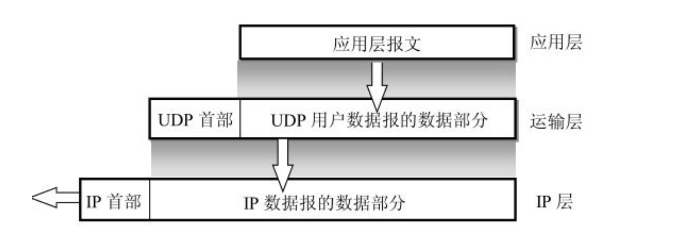
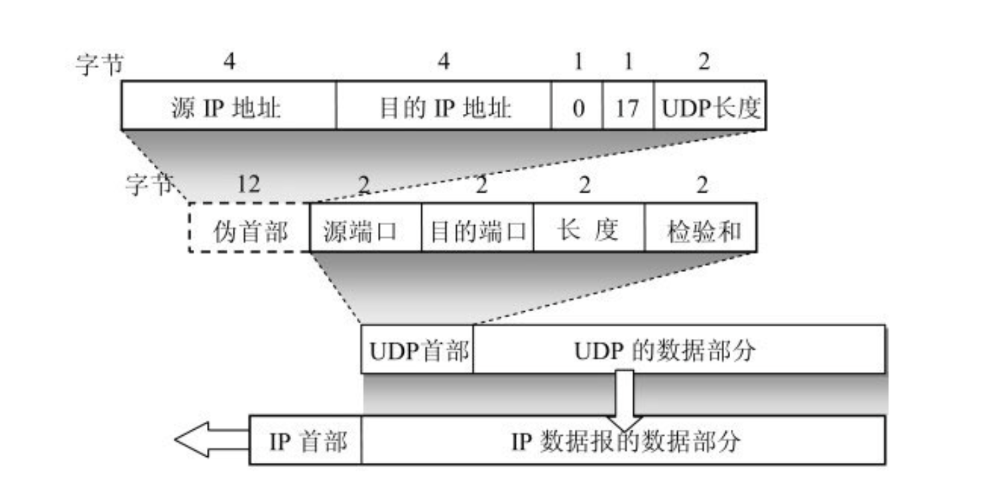

## UDP

#### 一、概述

UDP是无连接的，即发送数据之前不需要建立连接，因此减少了开销和发送数据之前的时延。

UDP使用尽最大努力交付，即不保证可靠交付，因此主机不需要维持复杂的连接状态表。

UDP是面向报文的。发送方的UDP对应用程序交下来的报文，在添加首部后就向下交付IP层。UDP对应用层交下来的报文，既不合并，也不拆分，而是保留这些报文的边界。

UDP没有拥塞控制，因此网络出现的拥塞不会使源主机的发送速率降低

UDP支持一对一、一对多、多对一和多对多的交互通信

### 二、UDP的首部格式

(1) 源端口 源端口号。在需要对方回信时选用。不需要时可用全0。

(2) 目的端口 目的端口号。这在终点交付报文时必须要使用到。

(3) 长度 UDP用户数据报的长度，其最小值是8（仅有首部）。

(4) 检验和 检测UDP用户数据报在传输中是否有错。有错就丢弃。

UDP用户数据报首部中检验和的计算方法有些特殊。在计算检验和时，要在UDP用户数据报之前增加12个字节的伪首部。所谓“伪首部”是因为这种伪首部并不是UDP用户数据报真正的首部。只是在计算检验和时，临时添加在UDP用户数据报前面，得到一个临时的UDP用户数据报。检验和就是按照这个临时的UDP用户数据报来计算的。伪首部既不向下传送也不向上递交，而仅仅是为了计算检验和。